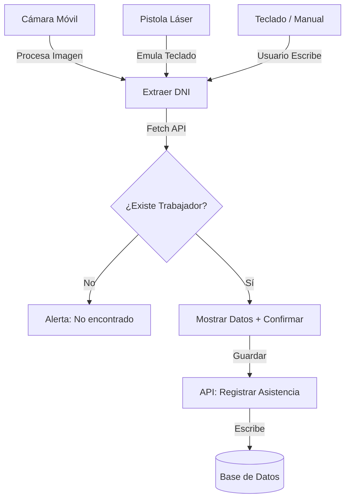

# Diagrama de Vistas y Flujo de Datos (Actualizado)

Este documento describe la navegación de la app y cómo viaja la información entre los diferentes métodos de registro.

## 1. Mapa de Vistas (Flujo de Navegación)

1.  **Login:** Acceso para administradores/operadores.
2.  **Dashboard Principal:** Resumen de asistencia y alertas.
3.  **Módulo de Marcación:** Pantalla centralizada con tres opciones:
    *   [Opcion 1] -> **Cámara (Barcode)**
    *   [Opcion 2] -> **Escáner Láser (Barcode)**
    *   [Opcion 3] -> **Ingreso Manual (Input + Botón)**
4.  **Modal de Confirmación:** Muestra datos del trabajador, hora actual y campo de **Observaciones** (si aplica).
5.  **Módulo de Reportes:** Filtros avanzados y exportación Excel.

## 2. Flujo de Datos (Data Flow)

### Métodos de Entrada

### Datos de Salida (Reporte Excel)
El flujo hacia Excel recolecta los siguientes puntos de datos por cada registro:
*   **Identidad:** DNI, Nombre Completo.
*   **Estructura:** Área, Puesto.
*   **Tiempo:** Fecha, Hora Entrada, Hora Salida.
*   **Estado:** Puntual, Tardanza, Falta.
*   **Adicionales:** Observaciones (Justificaciones de tardanza o registro de horas extra).

---

## 3. Estados de la Interfaz
*   **En Espera:** UI limpia, foco en el campo de entrada (para el láser) o cámara activa.
*   **Validando:** Consulta a la DB en progreso.
*   **Confirmado:** Feedback visual (Animación verde) y sonoro.
*   **Error:** Feedback visual (Animación roja) y mensaje descriptivo.
